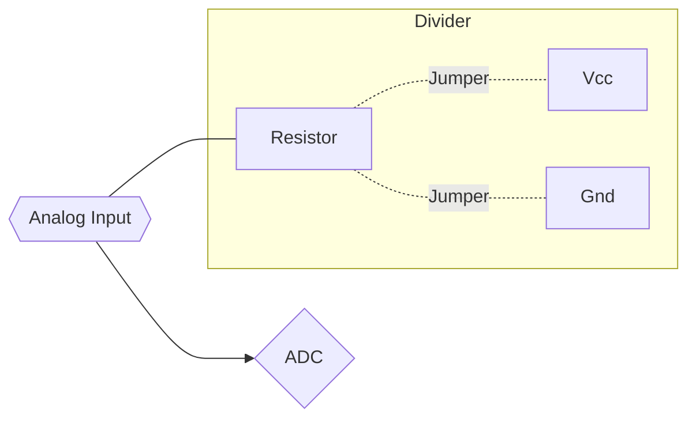
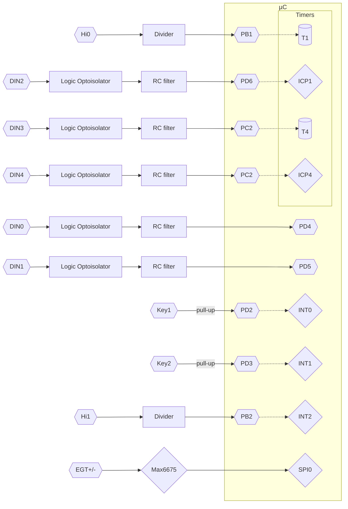
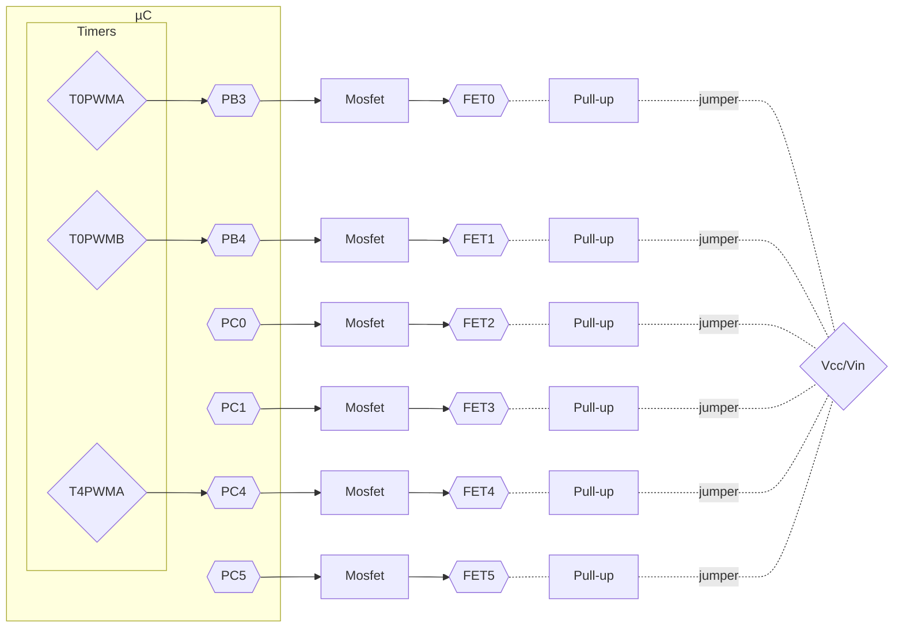

# Hardware

PCB gerber files and schematic are located in Hardware directory. 

## Periphals flow design

### Analog Inputs
There are 8 of analog inputs designed like that: 

### Digital Inputs

### Digital Outputs

### Display
Project was designed to use any of NEXTION displays, which adds flexibility to whole system. 
Display must be connected to J1 Connector. 
Further informations can be obtained at manufacturers [webpage.](https://nextion.tech/datasheets/) 
