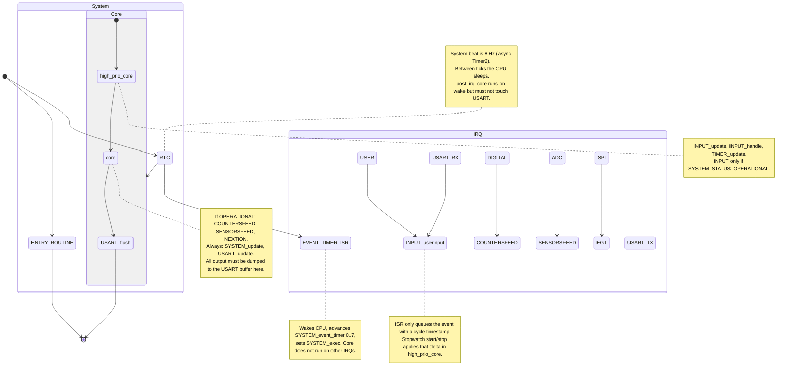

# Software
 
 

[It's not bug it's a feature](known-issues.md) 

### Simplified system design

```mermaid
stateDiagram-v2

[*] --> initialize
initialize --> [*]
[*] --> rtc
rtc --> EVENT_TIMER_ISR
rtc --> Core
flush --> [*]

state IRQ {
    USER --> INPUT_userinput
    USART_RX --> INPUT_userinput
    DIGITAL --> COUNTERSFEED
    ADC --> SENSORSFEED
    SPI --> EGT
    USART_TX
    EVENT_TIMER_ISR
    note right of INPUT_userinput
        ISR only queues the event with a cycle timestamp.
        Stopwatch start/stop applies that delta in high_prio_core.
    end note
    note right of EVENT_TIMER_ISR
        Wakes CPU, advances SYSTEM_event_timer 0..7,
        sets SYSTEM_exec. Core does not run on other IRQs.
    end note
}

state System {
    rtc: RTC
    initialize: ENTRY_ROUTINE
    state Core {
        [*] --> high_prio
        high_prio --> update
        update --> flush
        high_prio: high_prio_core
        update: core
        flush: USART_flush
        note right of high_prio
            INPUT_update, INPUT_handle, TIMER_update.
            INPUT only if SYSTEM_STATUS_OPERATIONAL.
        end note
        note right of update
            If OPERATIONAL: COUNTERSFEED, SENSORSFEED, NEXTION.
            Always: SYSTEM_update, USART_update.
            All output must be dumped to the USART buffer here.
        end note
    }
    note left of rtc
        System beat is 8 Hz (async Timer2).
        Between ticks the CPU sleeps.
        post_irq_core runs on wake but must not touch USART.
    end note
}

```