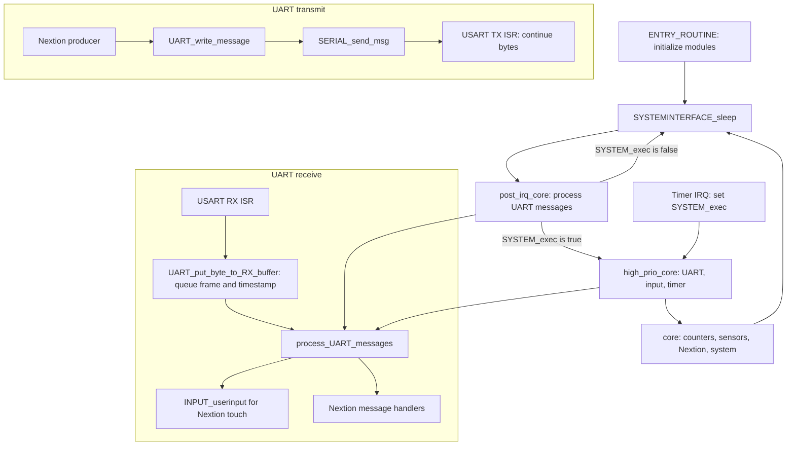

# Software

[It's not bug it's a feature](known-issues.md)

### Simplified system design

The asynchronous Timer2 beat runs at 8 Hz. Other IRQs may wake the CPU and let
`post_irq_core` process queued UART frames, but only the timer IRQ schedules the
high-priority and regular core cycle. UART RX handlers queue complete frames;
application handlers run outside the RX ISR and receive the frame timestamp.

Hardware WDT is 1 s, enabled at boot and refreshed from `SYSTEM_update` each 8 Hz beat; BOD (4.3 V) is a fuse setting, not firmware.
